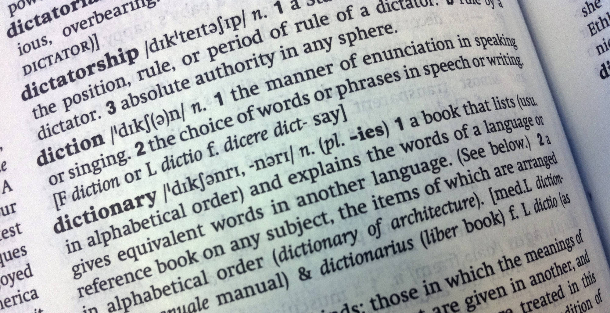

# Proyecto-final-DAD

    

## Índice

- [Introducción](#intro)

- [Codigo](#code)

### Introducción 

En este repositorio se realizara el trabajo final para la asignatura de __Desarrollo de Interfaces (DAD)__, la intención es crear un programa el cual te ofrezca unas definiciones y mediante estas el usuario tendra que averiguar la palabra, en el caso que se equivoque aumentaran la cantidad de descripciones.

### Codigo 

En `App.vue` cargamos el componente principal `TestPage.vue`. En el, tenemos realizada toda la estructura del proyecto, desde el se llama tanto a los componentes `wordDescription.vue` y `wordInsertGuess.vue` como a los modulos que dictan el funcionamiento de la aplicacion `useWordGame.ts`.

## Documentación generada con VueDocGen.

### WordDescription

| Prop name   | Description                                                                  | Type   | Values | Default |
| ----------- | ---------------------------------------------------------------------------- | ------ | ------ | ------- |
| definitions | An array of word definitions.                                                | Array  | -      |         |
| failCount   | The number of failed guesses, which determines how many definitions to show. | number | -      |         |

### WordInsertGuess

| Prop name     | Description                                          | Type           | Values | Default |
| ------------- | ---------------------------------------------------- | -------------- | ------ | ------- |
| checkGuess    | Function to handle the user's guess verification.    | TSFunctionType | -      |         |
| feedback      | The feedback message to display to the user.         | union          | -      |         |
| feedbackColor | The color of the feedback message text.              | string         | -      |         |
| gameStatus    | The current status of the game (Playing, Won, etc.). | GameStatus     | -      |         |

